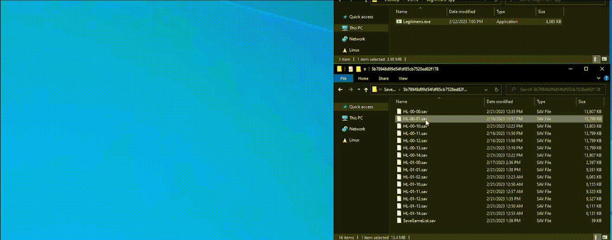
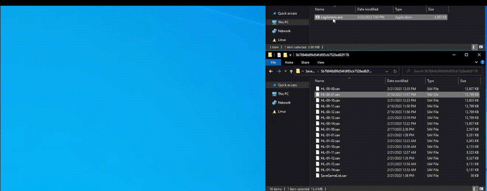

# Legilimens
Legilimens is a tool to help you find your last few missing collectibles in Hogwarts Legacy and finally get that 100% completion. All you need to do is run Legilimens with your save file, and it will analyze and return a list of every collectible that you're missing, including a link to a Youtube video with a timestamp showing its location. Legilimens does **not** edit your save file, it only reads the databases contained within it.

You can find the old (Python) version of this tool [here](https://github.com/Malin001/Legilimens-Hogwarts-Legacy-Collectible-Finder). You can also find this tool on [Nexus](https://www.nexusmods.com/hogwartslegacy/mods/556).

#### What Legilimens can find:
- Field Guide Pages
- Collection Chests
- Demiguise Statues
- Vivarium Chests
- Butterfly Chests
- Daedalian Keys
- Merlin Trials
- Balloon Sets
- Landing Platforms
- Ancient Magic Hotspots
- Infamous Foes

#### What it *can't* find:
- Items that you are *required* to get during a quest. For example, there are two field guide pages that you are forced to pick up during the History of Magic class quest
- Collectible items that can be bought from vendors
- Collectible items that are rewards for completing quests

## Usage
In the new version of Legilimens, only the Legilimens.exe file is required. Simply drag and drop your save file onto Legilimens.exe and it will automatically run. You can alternatively just run Legilimens.exe by itself and input the path to your save file when prompted. Note that you can likely find your save files in `C:/Users/<user>/AppData/Local/HogwartsLegacy/Saved/SaveGames/<user_id>/`

## FAQ
#### I have 33/34 Field Guide Pages in The Bell Tower Wing, but Legilimens says I've completed them all. Where is it?
- This is a known bug in Hogwarts Legacy that has since been patched, where a certain Bell Tower Wing [flying page](https://youtu.be/KnHZ5gVb_qk&t=104) doesn't count towards your total.
#### Legilimens says that I'm missing something that I've already collected, or doesn't detect all of my missing collectibles, or links to the wrong Youtube video/timestamp, or any other error.
- It's likely an error in my code, so open an [issue](https://github.com/Malin001/Legilimens-Hogwarts-Legacy-cpp/issues) on GitHub, and attach your `.sav` file. I'll do my best to figure out what went wrong and fix it as soon as possible.

## Credit
A huge thank you to [100% Guides](https://www.youtube.com/@100Guides) on Youtube for making the majority of the videos that Legilimens links to, as well as [Game Guides Channel](https://www.youtube.com/@GameGuideslolz) and [ZaFrostPet](https://www.youtube.com/@ZaFrostPet), whose videos I used when 100% Guides' videos had errors.

Also thanks to [ekaomk](https://github.com/ekaomk/Hogwarts-Legacy-Save-Editor), whose Hogwarts Legacy Save Editor code I looked at to learn how to read the save files.
